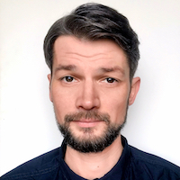

# Aliaksei Serada
Wroclaw, Poland (GMT +1)

---

*  [mastaka.net](https://mastaka.net/about)
*  [mastaka.design@gmail.com](mailto:mastaka.design@gmail.com)
*  [Mastak A (@mastaka)](https://discordapp.com/users/591698499347939339)
*  [alexserada](https://www.linkedin.com/in/alexserada/)
*  [mastaka](https://github.com/mastaka)

---
##### SUMMARY

Versatile Graphic Designer and Illustrator with a decade of global recognition. Started as a Microstock Illustrator in 2013, contributing to major platforms like [Shutterstock](https://www.shutterstock.com/g/MastakA) and [Adobe Stock](https://stock.adobe.com/contributor/203860893/Mastak_A). Transitioned to a successful Freelance Graphic Design and Illustration career in 2018, achieving Top-Level status on [99Designs](https://99designs.com/profiles/mastak). Proficient in Adobe Creative Cloud and Affinity, showcasing expertise in raster and vector graphics, traditional illustration, and digital animation, along with knowledge of diffusion-based generative models.

In June 2024, I started the **JS/FE Pre-School 2024Q2** course at RS School, hoping to learn basic programming skills and further dedicate my life to the machine learning related IT-industry.

---

